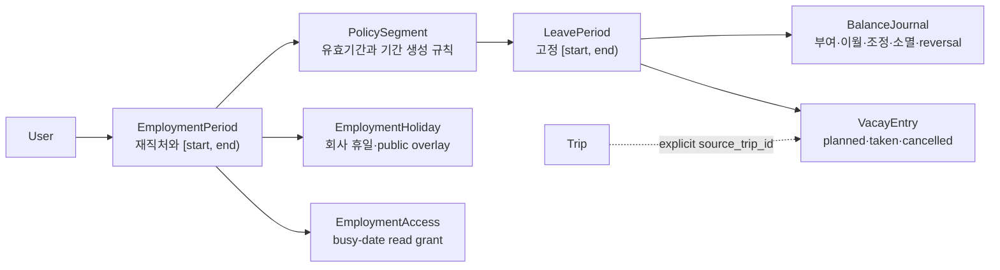

# Vacay Employment and Balance Design

> 작성일: 2026-07-28
> 상태: 3관점 적대 리뷰 PASS, 구현 전 upstream Discord 범위 승인 대기
> 기준: fork `main` `c5ff1d27`, upstream `dev` `292f1b18`

## 결론

Vacay를 단순한 `연도별 부여일수 - 달력 항목 수` 계산기에서 개인용
재직기간·휴가기간·잔액 추적기로 확장한다. 회사 변경과 정책 변경은 과거 값을
재해석하지 않고 유효기간이 있는 새 레코드로 남기며, 사용자는 `현재 잔여만 알고
있음`과 `총 부여·기사용을 알고 있음` 두 방식으로 시작할 수 있어야 한다.

범용 재직·기간·잔액·권한 모델은 `upstream-contrib` 후보이고, 한국 법정 산정은
코어 조건문이 아니라 사용자 확인형 policy provider로 분리한다. 현재 plugin
계약만으로는 native Vacay UI, core DB transaction, 공유·MCP 권한을 함께 보장할 수
없으므로 장기 원장을 plugin-owned DB에 먼저 구현하지 않는다.

첫 release의 대상은 한 회사에 재직하며 HR이 알려 준 특정일 현재 잔여를
종일·반일로 기록하려는 개인 사용자다. 완전한 원장을 먼저 만들지 않고
`단일 재직처 + 명시적 현재 기간 + opening cutoff + planned/taken + 비파괴
휴일 overlay`를 최소 수직 기능으로 제공한다. correctness 수정과 schema/API/UI는
각각 독립 PR로 나누되, 사용자가 실제로 쓸 수 있는 제품 release는 이 수직 기능이
모두 검증된 뒤에만 선언한다.

세 관점의 blocker와 채택·기각 결정을 정규화한 기록은
[adversarial review](2026-07-28-vacay-employment-balance-adversarial-review.md)에
있다.

## 승인된 제품 기본값

| 결정                   | R1 기본값                        | 이유                                                                             |
| ---------------------- | -------------------------------- | -------------------------------------------------------------------------------- |
| 동시 재직              | 제외                             | 한 시점에 활성 재직처 하나, 과거 재직처는 여러 개를 허용해 첫 범위를 제한한다.   |
| 공유                   | 후속 release의 `busy dates only` | 회사명, 정책, 잔액, 메모, 조정 사유를 공유하지 않으며 첫 수직 기능과 분리한다.   |
| 한국 법정 자동 산정    | R2                               | 회사 규정·출근율·퇴직 정산 등 입력 없이 법정 잔액으로 확정하면 오판 위험이 크다. |
| 수량 저장              | 정수 minute                      | R1 UI는 종일/반일만 제공하되 시간 단위 확장을 막지 않는다.                       |
| 사용량 source of truth | `VacayEntry`                     | 잔액 journal에 사용량을 중복 기록하지 않는다.                                    |
| 회사 변경              | 이전 잔액 자동 이전 없음         | 새 재직처에 opening balance를 별도로 설정한다.                                   |
| 기간 중 정책 변경      | 다음 휴가기간부터 적용           | 이미 생성된 기간과 과거 수량의 재해석을 막는다.                                  |
| 자동 carry·expiry      | 제외                             | R1은 사용자가 확인한 signed adjustment만 기록한다.                               |
| offline write          | 제외                             | 충돌·중복 command queue 없이 read cache와 미전송 draft만 허용한다.               |

## 제품 경계

### 목표

- 한국 사용자가 회사별 재직기간과 휴가 기준기간을 명시적으로 관리한다.
- 회사 기준일, 입사일 기준, 직접 지정 기간을 모두 표현한다.
- 기사용, 예정 사용, 현재 잔여와 조정 근거를 구분한다.
- 회사·정책 변경 뒤에도 과거 기간과 계산 결과가 바뀌지 않는다.
- 기존 반차, 대체·보상휴무, 공휴일 overlay, 여행 계획, 읽기 전용 공유와
  호환된다.

### 비목표

- 휴가 신청·상사 승인, 관리자 결재선
- 급여·미사용수당·퇴직 정산의 확정 계산
- 근태·출퇴근, HRIS, 조직도와 부서 관리
- 법적 적합성 인증 또는 노무·법률 자문
- 사업자번호, 계약서, 증빙 문서 수집
- 첫 release의 busy-date 공유, offline write queue, 자동 legacy backfill
- 같은 날 오전·오후를 서로 다른 종류로 나누는 복수 segment

이 기능은 개인 자기관리 도구다. 회사 HR 시스템으로 확장하지 않는다.

## 현재 상태와 선행 결함

최신 `upstream/dev`에는 반차(`#1631`), 보기 전용 공유(`#1637`),
대체·보상휴무와 calendar/fiscal/anniversary 기간(`#1679`)이 들어와 있다. 그러나
다음 구조적 한계는 남아 있다.

| 심각도 | 현재 동작                                                        | 근거와 영향                                                                            |
| ------ | ---------------------------------------------------------------- | -------------------------------------------------------------------------------------- |
| HIGH   | 사용자당 휴가기간 설정 한 행                                     | `vacay_user_settings.user_id`가 PK라 설정 변경 시 과거·미래 기간이 함께 재해석된다.    |
| HIGH   | GET stats가 다음 해 carry를 UPSERT                               | read-only REST/MCP 호출이 DB 상태를 바꾸며, write만 제거하면 다음 해 값이 stale해진다. |
| HIGH   | 회사·공휴일 적용이 휴가 entry를 삭제                             | 외부 holiday 데이터나 공동 사용자의 조작으로 개인 기록이 사라질 수 있다.               |
| HIGH   | fusion 참여자가 타인의 entry와 allowance를 수정                  | 표시 그룹이 데이터 소유권과 관리자 권한으로 확대된다.                                  |
| HIGH   | fusion 해제 시 최신 user-year 상태가 개인 plan으로 돌아오지 않음 | 재직 중 수정된 잔액이 과거 값으로 되돌아갈 수 있다.                                    |
| HIGH   | 여행 시작일 변경이 같은 기간의 모든 개인 Vacay entry를 이동      | entry에 trip 출처가 없어 무관한 휴가도 이동한다.                                       |
| MED    | 하루·사용자·plan당 한 행                                         | 오전 연차와 오후 보상휴무, 시간 단위, 동시 재직을 표현하지 못한다.                     |

기능 구현 전에 독립 PR로 다룰 correctness 범위는
[upstream correctness proposal](2026-07-28-vacay-upstream-correctness-proposal.md)에
분리한다.

## 도메인 모델



### `EmploymentPeriod`

- `user_id`
- 사용자가 정한 회사 표시 이름
- `country_code`
- `starts_on`, nullable `ends_on`; `[start, end)` 계약
- IANA `timezone`
- `default_day_minutes`
- 색상, active/archived 상태
- aggregate `revision`

MVP는 같은 날짜에 둘 이상의 active employment를 금지한다. 과거 employment는
읽기·정정 가능하고 기록이 있으면 hard delete 대신 archive한다.

### `PolicySegment`

- `employment_id`
- `effective_from`, nullable `effective_to`
- `period_basis`:
  `calendar_year | company_cycle | anniversary | custom_once`
- 기준 월·일 또는 직접 지정 규칙
- 2월 29일 anniversary의 사용자 확인형 `leap_day_rule: feb_28 | mar_1`
- nullable `day_minutes_override`

정책 변경은 기존 행 수정이 아니라 새 segment 생성이다. 이미 생성된
`LeavePeriod`의 날짜와 snapshot은 바꾸지 않는다. R1에서는 현재 기간 중간에
정책을 적용하지 않고 다음 `LeavePeriod.starts_on`부터만 적용한다. 소급·중도
분할은 영향 미리보기와 별도 정정 계약이 필요한 R2 범위다.

### `LeavePeriod`

- `employment_id`, `policy_segment_id`
- `starts_on`, `ends_on`; 항상 `[start, end)`
- 사람이 읽을 label
- 생성 당시 `basis_day_minutes` snapshot
- aggregate `revision`
- `open | closed` 상태

`2026` 같은 숫자만 보여 주지 않고 `2026-09-16 – 2027-09-15`처럼 실제 범위를
표시한다. UI의 마지막 날은 inclusive로 보여 주지만 API와 DB의 `ends_on`은
exclusive다.

회사 cycle window와 실제 employment coverage는 분리한다. 예를 들어
2026-07-15 입사자가 1월 1일 company cycle을 쓰면 period는
`[2026-01-01, 2027-01-01)`, 사용 가능한 coverage는
`[2026-07-15, 2027-01-01)`이다. 2026-10-31을 마지막 근무일로 입력하면
employment `ends_on`은 `2026-11-01`로 저장하고 coverage만 그 지점에서 자른다.
과거 period 자체는 다시 쓰지 않는다. 2월 29일 anniversary는 사용자가 HR 규칙에
맞춰 `feb_28` 또는 `mar_1`을 선택한 뒤 생성 preview를 확인한다. 2024-02-29
입사에서 `feb_28`은 첫 period `[2024-02-29, 2025-02-28)`, 다음 period
`[2025-02-28, 2026-02-28)`이고, `mar_1`은 첫 period
`[2024-02-29, 2025-03-01)`, 다음 period `[2025-03-01, 2026-03-01)`이다.
employment coverage 밖의 새 entry는 거부하고, legacy 밖 날짜는
`review_required`로 보낸다.

### `BalanceJournal`

허용 원인은 다음으로 제한한다.

- `opening_balance`
- `grant`
- `carry_in`
- `manual_adjustment`
- `expiry`
- `reversal`

각 행은 signed `delta_minutes`, 당시 `basis_day_minutes`, `effective_on`,
`reason`, nullable `reverses_journal_id`를 가진다. opening은 선사용을 표현할 수
있도록 signed이고 grant/carry는 양수, expiry는 음수다. manual adjustment와
reversal은 양수 또는 음수일 수 있다. reversal은 원본의 정확한 반대값이며 한
원본은 한 번만 reverse할 수 있다.

사용량은 journal에 다시 기록하지 않는다. 확정된 행을 덮어쓰거나 삭제하지 않고
`create/read/reverse`만 허용한다. period에는 reverse되지 않은 opening 하나만
허용하며 교체는 기존 opening reversal과 새 opening을 같은 transaction에서
기록한다. R1에서는 entitlement lot과 allocation을 만들지 않으므로 정확한
FIFO·소멸·이월 추적을 지원한다고 표현하지 않는다.

### `VacayEntry`

- `employment_id`, `leave_period_id`
- `date`, `quantity_minutes`, 당시 `basis_day_minutes`
- `kind`: 기존 `vacation | comp`와 호환
- `status`: `planned | taken | cancelled`
- `balance_effect`: `deduct | included_in_opening`
- nullable `source_trip_id`
- 메모, 작성자, aggregate `revision`과 변경 시각

R1 UI는 종일/반일만 선택할 수 있다. canonical 수량은 양의 정수 minute이고
event 당시의 `basis_day_minutes`를 snapshot한다. 하루에 한 개의 활성 entry만
허용하는 제한을 UI와 API에 표시하며, 같은 날 복수 segment는 R2로 미룬다.

`planned`는 직접 수정할 수 있다. `taken` 정정은 원본을 `cancelled`로 보존하고
replacement entry를 만드는 command로만 수행한다. `cancelled`는 다시 수정하지
않는다.

### `EmploymentHoliday`

회사 휴일은 plan 전역이 아니라 employment에 속한다. 종류는
`public_holiday | paid_company_day | annual_leave_substitution | unknown`으로
구분한다. 공휴일 provider 결과는 overlay/provenance로 취급하며 개인 entry를
자동 삭제하거나 종류를 바꾸지 않는다. 차감은 명시적인 Vacay entry에서만
결정한다.

R0 correctness에서는 durable manual company holiday만 비차감 projection이
가능하다. R1의 public holiday 비차감은 provider/source identity,
observed/effective dates와 active/superseded 상태를 가진 durable occurrence를
저장한 뒤에만 검토할 수 있다. provider occurrence의 기본
`balance_treatment=pending`은 기존 entry와 잔액을 바꾸지 않는다. 사용자가
`non_deduct | deduct`를 확인해야 projection에 반영하며, live provider 응답만으로
과거 잔액을 재해석하지 않는다. `annual_leave_substitution`은 사용자가 명시적인
deducting vacation entry를 연결한 경우에만 확정할 수 있다.

### `EmploymentAccess`

첫 수직 기능 뒤의 grant는 employment별 `busy_dates` 읽기만 제공한다. planned와
taken은 busy이고 cancelled는 제외한다. payload에는 날짜와 busy 상태를 제외한
회사명, 재직기간, 정책, 잔액, journal, fraction, 상태, 메모가 없어야 한다. 회사
변경 시 이전 employment의 grant를 새 employment로 자동 승계하지 않는다.

## 계산 계약

```text
current_balance =
  sum(signed_balance_journal) - deductible_taken_entries

available_after_planned =
  current_balance - deductible_planned_entries
```

- `deductible_taken_entries`는 `status=taken`,
  `balance_effect=deduct`이고 holiday conflict가 없거나
  `balance_treatment=pending | deduct`인 휴가 entry를 합산한다. 사용자가
  `non_deduct`로 확인한 conflict만 제외한다.
- `cancelled`와 `included_in_opening` entry는 둘 다 차감하지 않는다.
- `comp` entry는 연차 account를 차감하지 않는다.
- `comp`는 R1에서 잔액 검증이 없는 사용자 입력 휴무이며 연차 summary와 분리한다.
- 회사·공휴일은 entry를 지우지 않는다. provider 겹침은 pending conflict로
  표시하되 사용자 확인 전 산술을 바꾸지 않는다.
- 양은 DB와 API에서 integer minute이며 UI만 `일`로 환산한다.
- 계산 결과가 음수여도 기록을 거부하지 않고 경고와 함께 표시한다.
- 하나의 command가 journal과 entry를 동시에 바꿔야 하면 같은 transaction에서
  처리한다.

### 초기 잔액 입력

`총 부여·기사용을 알고 있음`:

- 기준일의 `opening_balance = reported_grant - reported_used`
- metadata에 nonnegative `reported_grant`, `reported_used`,
  `usage_included_through`를 보존
- 기사용을 나타내는 가짜 날짜 entry는 만들지 않음

`현재 잔여만 알고 있음`:

- 기준일의 signed `opening_balance = reported_remaining`
- 부여·기사용은 `unknown`
- 기준일 이전과 당일의 기존 `taken` entry는 출처와 무관하게
  `included_in_opening`으로 보여 주되 다시 차감하지 않음

active opening journal metadata가 `usage_included_through`의 canonical source다.
period summary는 그 값을 파생해 보여 주며 period에 중복 저장하지 않는다. cutoff는
employment timezone의 inclusive 달력 날짜다. 그 날짜 이전이나 당일의 `taken`을
나중에 입력할 때는 `opening에 이미 포함`을 기본으로 하며, 사용자가 `지금 차감`을
명시적으로 선택할 수 있다. planned는 기본 `deduct`다. HR 잔여가 예정 사용까지
반영한 값이면 opening metadata의
`usage_scope: taken_and_planned`를 사용자가 preview에서 선택하고 해당 planned만
`included_in_opening`으로 확정한다. 기본 scope는 `taken_only`다.

예: 2026-07-28 현재 잔여 7.5일을 opening으로 입력하면 2026-07-01 taken은
기본 비차감이고, 2026-07-29 taken은 차감한다. 7월 1일 기록을 나중에 추가해도
자동 이중 차감하지 않는다. cutoff 당일 planned는 `taken_only` 기본값에서 예정
가용량을 차감한다.

R1의 opening 교체는 같은 `usage_included_through`와 `usage_scope`에서만 허용한다.
cutoff 또는 scope 변경은 기존 entry의 `balance_effect` preview와 재분류가 필요한
별도 `rebaseline` command로 미루며 일반 reversal/replacement로 우회하지 않는다.

### Command와 동시성

모든 write surface는 application service의 동일 command를 호출한다.

- command receipt는 `(actor_id, operation, idempotency_key)`와 request payload
  hash, 결과를 같은 transaction에 저장한다.
- 같은 key와 같은 payload의 재시도는 저장된 결과를 반환한다.
- 같은 key와 다른 payload는 `409 conflict`다.
- idempotency와 별도로 aggregate `expected_revision`을 요구한다. employment,
  policy와 period lifecycle command는 `EmploymentPeriod.revision`, journal과
  entry command는 `LeavePeriod.revision`을 compare-and-increment한다. stale
  revision, 기간 중첩 또는 opening 경쟁은 transaction 안에서 다시 검사하고
  `409`로 반환한다.
- R1은 v2 WebSocket을 발행하지 않는다. R1+에서 추가할 때만 commit 뒤 aggregate
  ID와 새 revision을 보내며 민감한 회사·잔액·메모는 event payload에 넣지 않는다.
- 조회는 carry, plan, period, entry 상태를 생성하거나 바꾸지 않는다. legacy
  personal plan의 lazy provisioning은 이 목표와 별개의 기존 부채로 추적한다.

DB는 half-open date check, 사용자별 employment 비중첩, policy/period 비중첩,
period와 entry/journal의 동일 employment 소유권, 양의 quantity, opening 유일성,
R1의 employment/date별 non-cancelled entry 유일성, reversal 유일성과 immutable
column을 constraint/trigger로 방어한다. Zod와 service 검증만으로 이 불변식을
대신하지 않는다.

## 권한 계약

| 데이터/동작           | 본인                       | fusion 사용자                      | busy-date viewer | 관리자 일반 API |
| --------------------- | -------------------------- | ---------------------------------- | ---------------- | --------------- |
| employment·입사일     | create/read/archive        | 불가                               | 불가             | 자동 우회 불가  |
| policy·period         | create/read/close          | 불가                               | 불가             | 자동 우회 불가  |
| journal·잔액 조정     | create/read/reverse        | 불가                               | 불가             | 자동 우회 불가  |
| 본인 entry            | create/read/cancel/correct | R1 불가; R1+ `edit_events` grant만 | 불가             | 자동 우회 불가  |
| busy dates            | 조회                       | plan 표시 범위에서 조회            | 허용             | 자동 우회 불가  |
| 회사명·정책·잔액·메모 | 조회                       | 본인 소유만                        | 불가             | 자동 우회 불가  |

R1의 REST, MCP와 host-mediated plugin command가 같은 application service 권한
판정을 사용한다. unsupported plugin write는 fail-closed하고 v2 WebSocket은
발행하지 않는다. fusion은 기본적으로 캘린더 표시 그룹이며 데이터 소유권을
이동시키지 않는다. 기존 fusion endpoint를 호환한다는 이유로 self-only 정책을
우회하지 않는다.

R1에는 `EmploymentAccess` write가 없으므로 connected fusion cohort는 activation할
수 없다. 사용자가 R0 correctness가 적용된 fusion 해제를 선택해 solo가 되거나,
R1+ Task 11에서 `busy_view`/`edit_events` grant와 scoped WebSocket이 구현될 때까지
legacy v1을 유지한다.

## 주요 사용자 흐름

### 첫 설정

1. 회사 표시 이름과 입사일을 입력한다.
2. R1에서는 `매년 1월 1일`, `회사가 정한 월·일`, `입사일` 중 하나를
   선택한다. `직접 한 번 지정`은 후속 release다.
3. `현재 잔여만 입력` 또는 `총 부여·기사용 입력`을 선택한다.
4. timezone, 생성될 inclusive 표시 기간과 opening cutoff를 미리 본다.
5. 확인 command 한 번으로 employment, policy, period, opening을 생성한다.

### 회사 변경

1. 이전 employment 종료일과 새 employment 시작일을 함께 확인한다.
2. 이전 회사의 퇴사일 이후 planned entry, 회사 휴일, trip 연결과 공유 grant의
   영향 목록을 보여 준다.
3. 퇴사일 뒤 planned entry는 활성 상태로 이전 회사에 남길 수 없다. 각각
   `취소된 감사 기록으로 보존 | 새 회사 opening 확정 뒤 다시 생성` 중 선택하며
   기본값은 취소다.
4. 미래 입사일과 재직 공백은 허용하고 기간 겹침만 transaction에서 차단한다.
5. 이전 기록과 잔액을 archive하되 변경하지 않는다.
6. 새 회사에 별도 정책과 opening balance를 입력한다.
7. 이전 잔액과 공유 grant는 자동 이전하지 않는다.

### 정책 변경

새 정책과 다음 휴가기간의 날짜·수량 영향 미리보기를 제공한다. R1의
`effective_from`은 다음 `LeavePeriod.starts_on`과 같아야 한다. 과거 segment와
이미 생성된 period는 immutable이고, 기간 중간 소급 적용은 저장하지 않는다.

### 휴가 등록과 정정

- employment timezone의 미래 날짜는 `planned`, 지난 날짜는 기본 `taken`으로
  제안하되 사용자가 바꿀 수 있다.
- 시간이 지나도 조회가 `planned`를 자동 변경하지 않는다. 지난 planned는
  `needs_confirmation`으로 파생해 일괄 확인 CTA를 제공한다.
- 날짜를 다시 누르면 즉시 삭제하지 않고 편집 sheet를 연다.
- planned는 직접 수정할 수 있다. taken 정정은 `cancelled + replacement`,
  journal 정정은 reversal을 사용한다.
- trip 날짜 변경은 `source_trip_id`가 정확히 일치하는 planned entry만 사용자 확인
  뒤 이동한다.

### 기존 사용자 activation

legacy 값은 자동으로 회사 사실이나 opening으로 확정하지 않는다. 전환 wizard는
원본 plan/year 값, 기간, entry 수, 휴일 overlay, 예상 opening과 충돌을 보여 준다.
opt-in 전에는 기존 v1 write를 유지하고 v2 candidate preview만 read-only다. 각
사용자는 본인 소유 원본과 변환 결과만 보고 source checksum·revision에 동의한다.

R1 activation은 신규 사용자와 solo legacy 사용자만 허용한다. 최종 activation
transaction이 짧은 write lock 안에서 solo membership, source checksum과 revision을
다시 검사한다. 불일치하면 `review_required`로 돌아가고 lock을 해제하며 v1 write는
계속된다. 사용자가 activation을 취소하면 staged v2 row를 폐기하고
`legacy_active`로 남는다. 성공한 뒤에만 v2 single-write로 바뀐다.

connected fusion 사용자는 R0 correctness 적용 뒤 각자 fusion을 명시적으로
해제하고 solo 전환하거나 R1+ Task 11까지 legacy v1을 유지한다. R1+ cohort
activation은 각자 본인 checksum에 동의하고, 화면은 타인 데이터 대신
`대기/검토완료/동의완료` 집계만 공개하며 전원 동의·membership/checksum 재검사
뒤에만 실행한다. 한 사람도 타인을 대신 승인할 수 없다.

## UI/UX 구조

Vacay 안에 전역 메뉴를 늘리지 않고 기간 중심 캘린더를 유지한다.

- 상단 context: 재직처와 정확한 휴가기간
- 요약: 현재 잔여, 예정 반영 가용량, 사용, 부여·이월·조정
- 본문: 캘린더와 잔액 변동 drawer/sheet
- 설정: 재직처·정책과 휴일 overlay

R1 UI에는 후속 기능인 회사 변경·공유·custom period의 비활성 placeholder나 CTA를
렌더링하지 않는다.

상태 계약은 다음과 같다.

| 상태                   | 보이는 데이터                    | write와 복구                                            |
| ---------------------- | -------------------------------- | ------------------------------------------------------- |
| loading                | 마지막 검증 데이터 또는 skeleton | 중복 제출 차단                                          |
| empty/no employment    | 안내와 설정 시작 CTA             | 설정 wizard                                             |
| partial provider error | 마지막 core 잔액·수동 entry      | 수동 write 허용, provider만 retry                       |
| blocking load error    | 민감할 수 있는 stale 값 숨김     | 입력 draft 보존, 전체 retry 전 write 차단               |
| conflict               | server 값과 보존된 local draft   | 서버 재조회/비교 뒤 새 revision으로 재제출              |
| archived               | 읽기 전용 과거 기록              | 복원 가능한 설정만 명시, 직접 write 차단                |
| offline                | 마지막 성공 read와 local draft   | server write queue 없음, 연결 회복 전 저장 CTA 비활성화 |

R1 draft는 메모리 안에서만
`actor_id + aggregate_id + base_revision + source_checksum`으로 scope한다.
회사·잔액·메모를 `localStorage`, `sessionStorage` 또는 IndexedDB에 영속하지 않는다.
partial error, offline과 `409` 동안 현재 화면의 draft는 보존하지만 성공·취소·
로그아웃·계정 전환·route unmount에서 지운다. dirty 상태에서 navigation/reload를
시도하면 경고하며, 실제 reload 뒤 복원을 약속하지 않는다.

날짜는 실제 button/gridcell로 구현한다. 월 grid는 roving tabindex, 방향키,
Home/End, Enter/Space를 제공하고 접근성 이름에 날짜·수량·상태·휴일 충돌을 포함한다.
sheet는 focus trap, validation message 연결과 닫은 뒤 원래 날짜로 focus 복귀를
보장한다. 200% 확대, 44px mobile target과 색상 외의 상태 표기도 검증한다.

390px에서는 연간 보기를 read-only로 두고 한 달 편집을 sheet로 제공한다.
Fold/태블릿은 상단 context bar와 1~2열 월 카드, 1440px은 summary rail과 3~4열
캘린더를 기본으로 한다. Fold fixture는 임의 숫자를 쓰지 않고 실제 Fold 7에서
CSS viewport·orientation·browser 조건을 기록한 뒤 고정한다. 각 fixture에서
horizontal overflow 없음, 주요 CTA bounding-box 비충돌, 44px target, sheet
scroll 중 focus 가시성을 Given/When/Then으로 판정한다.

현재 route contract는 `<768px → MVacay`, `>=768px → VacayPageDesktop`이다.
따라서 펼친 Fold가 desktop/tablet route를 타면 그 fixture는 desktop PR에서
검증한다. UI 작업을 나누기 전 측정하고, mobile과 desktop 모두 첫 설정,
activation, opening, planned/taken 정정, holiday pending과 오류 상태의 기능
동등성을 가져야 한다.

## Release 범위

### R0 — 독립 correctness

- carry 산술을 stale하게 만들지 않는 read-pure stats
- 모든 holiday refresh에서 entry를 보존하고, durable manual company holiday의
  비차감 의미를 유지하는 projection
- join/leave/rejoin 전체에서 보존되는 fusion user-year
- 출처 없는 entry를 이동하지 않는 trip date change

각 항목은 별도 maintainer 승인과 별도 PR이다. R1 holiday import는 entry
preservation, trip-linked leave는 unlinked shift 차단을 선행한다. R1 activation은
원래 신규·solo 사용자만 허용하며, fusion correctness가 없으면 dissolution을 통한
solo 전환도 제공하지 않는다. 수용되지 않은 관련 legacy bridge/provider/trip
surface는 fail-closed한다.

### R1 — 최소 사용 가능 release

- 단일 active employment와 명시적 현재 leave period
- `calendar_year | company_cycle | anniversary`; `custom_once`는 후속
- 사용자 입력 opening과 inclusive `usage_included_through`
- signed opening/manual adjustment/reversal journal
- planned/taken/cancelled 종일·반일 entry와 분 단위 snapshot
- 비파괴 holiday overlay와 기존 `comp`의 비잔액 기록
- self-only REST/MCP application service와 revision/idempotency 계약
- read-only v2 candidate preview, 확인 wizard와 transactional solo activation
- 390px·실측 Fold·1440px의 최소 desktop/mobile UI

R1의 자동 carry/grant/expiry는 지원하지 않는다. 사용자가 HR 값을 확인해 signed
adjustment로 기록한다. backend PR 여러 개가 합쳐져도 위 전체 흐름이 통과하기
전에는 제품 MVP가 완료됐다고 하지 않는다.

### R1 후속

- 회사 변경 영향 wizard와 과거 employment archive
- `custom_once` 기간
- cutoff/scope 변경을 위한 rebaseline preview command
- employment별 busy-date 공유, scoped WebSocket과 connected cohort activation
- 회사 휴일 관리 고급 UI와 legacy overlay 승격

### R2

- 동시 active employment
- 시간 단위·같은 날 복수 segment UI
- 한국 policy suggestion provider와 versioned rule set
- entitlement lot/allocation과 정확한 expiry/carry/FIFO
- 대체·보상휴무 earned/used bank
- 소멸 예정 알림, CSV import/export, 사용자 정의 leave type

## 한국 정책 provider 경계

한국 규칙은 자동 확정 transaction을 만들지 않는다. 공식 자료와 정책 버전을
표시한 `proposal`을 만들고 사용자가 확인할 때만 grant/adjustment command로
전환한다. 회사 취업규칙, 상시근로자 수, 출근율, 단시간 근로, 퇴직 정산처럼
제품이 모르는 입력은 `unknown`으로 남긴다.

각 근거는 `statute | enacted_future | draft | interpretation | counseling`,
확인일, 시행일, 기속력 여부, URL을 구분한다. provider 결과에는
`rule_set_id`, assumptions, unknown inputs와 제안 command를 포함한다. 상담 답변,
법령, 입법예고를 같은 권위의 확정 규칙으로 합치지 않는다.

2026-07-28 기준 확인한 공식 자료:

- [근로기준법 현행본](https://www.law.go.kr/LSW/lsInfoP.do?chrClsCd=010202&efYd=20251023&joNo=002300&lsiSeq=265959&urlMode=lsInfoP)
- [회계연도 기준 운용과 퇴직 시 비교 정산에 관한 고용노동부 상담·행정해석 인용](https://1350.moel.go.kr/rtmview.do?id=1000120046&page=19616&type=BEST)
- [최초 1년 종료 후 15일 부여 법제처 해석](https://www.law.go.kr/LSW/expcInfoP.do?expcSeq=339035&mode=2)
- [반차는 회사 규정·노사 합의로 운영 가능하다는 고용노동부 안내](https://1350.moel.go.kr/rtmview.do?id=1000315635)
- [2027-06-10 시행 예정 시간 단위 분할 법률](https://law.go.kr/LSW/lsRvsDocListP.do?chrClsCd=010202&lsId=001872&lsRvsGubun=all)
- [반일·연 5일 시행령안 입법예고](https://moleg.go.kr/lawinfo/makingInfo.mo?currentPage=1&lawCd=0&lawSeq=87572&lawType=TYPE5&mid=a10104010000&pageCnt=10)

시행령안은 입법예고 상태이므로 확정 규칙으로 사용하지 않는다. 법령·해석·상담
자료는 법률 자문이 아니라 데이터 모델이 수용해야 할 변동성의 근거다.

## 호환·migration 전략

공식 구현은 최신 `upstream/dev`에서 additive schema와 read-only v2 candidate
projection으로 시작한다. startup migration은 v2 table만 만들며 회사·정책·잔액을
추론해 쓰거나 기존 v1 write를 잠그지 않는다.

별도 resumable importer가
`legacy_active → preview/review_required → reconciled → activation_locked
(transaction only) → activated` 상태, source checksum과 provenance를 관리한다.

1. `vacay_user_settings`, user-year와 entry를 dry-run candidate로 읽는다.
2. legacy fraction은 사용자가 확인한 day-minute basis로 환산한다. 알 수 없으면
   `legacy_unknown`이고 activation을 막는다.
3. 동일 user/year의 여러 plan 값, 기간 또는 소유권 충돌은 자동 선택하지 않고
   `review_required`에 보존한다.
4. legacy entry는 기존 fraction/kind를 보존하고 opening cutoff 포함 여부를
   preview한다.
5. plan company holiday는 회사 사실로 복사하지 않고
   `legacy_plan_overlay/unverified`로 둔다.
6. wizard가 원본 값·기간·entry 수·예상 잔액·충돌과 변환 결과를 보여 준다.
7. owner/FK, row count, source uniqueness, signed journal sum, entry 수량·날짜,
   orphan/conflict가 모두 맞아야 `reconciled`가 된다.
8. R1은 activation transaction에서 solo membership과 모든 source
   checksum/revision을 재검사한다. mismatch는 `review_required`로 되돌리고 v1
   write를 유지하며, 취소는 staged row를 폐기한다.
9. connected fusion activation은 EmploymentAccess가 존재하는 R1+까지 막는다.
   그때도 각 사용자가 본인 checksum에 따로 동의하고 readiness 집계만 공유한다.
10. activation 뒤 v2가 single-write source이고 legacy REST/MCP는 v2 projection을
    읽는다. 원본 table은 최소 두 release 동안 삭제하지 않는다.

장기 dual-write는 금지한다. rollback 경계는 다음과 같다.

- v2 write 전: code-only rollback 가능
- preview/reconciliation 뒤 activation 전: v1 write는 계속 가능하고 staged
  importer row를 검증 후 폐기 가능
- activation과 첫 v2 write 뒤: 기본은 forward-fix이며 feature flag는 read-only
  kill switch일 뿐 legacy write로 돌아가는 스위치가 아님
- 전체 DB restore: maintenance window, WAL을 포함한 online backup과 restore
  rehearsal, 다른 사용자 데이터 손실 평가가 있을 때만 수행

운영 pilot 전에는 per-cohort legacy shadow, downgrade eligibility report,
owner-only backup/restore 절차와 immutable image를 별도로 승인받는다.

## 모듈화와 기여 lane

| 범위                                  | lane                                 | 제거·확장 기준                                 |
| ------------------------------------- | ------------------------------------ | ---------------------------------------------- |
| employment/period/journal/access core | `upstream-contrib`                   | 공식 release에 포함되면 포크 adapter 없이 사용 |
| 한국 rule proposal provider           | plugin 또는 별도 generic provider PR | core policy-provider contract 확정 뒤 추가     |
| JSNetworkCorp 조기 pilot adapter      | 필요할 때만 `fork-core`              | 공식 release 통합과 동등성 검증 후 제거        |
| 도메인·Compose·운영 설정              | `instance-only`                      | 공식 PR 금지                                   |

현재 plugin SDK의 별도 SQLite와 제한된 Vacay API는 core DB와 원자적으로
transaction할 수 없고 native UI·공유·MCP를 일관되게 확장하지 못한다. 따라서
plugin-only 원장은 채택하지 않는다.

## 수용 기준

1. **[R1]** 회사 기준일과 입사일 기준 기간은 API/DB에서 정확한
   `[start, end)`이고 UI는 inclusive 마지막 날짜를 표시한다.
2. **[R1]** `2026-07-15` 입사·1월 1일 company cycle은 period
   `[2026-01-01, 2027-01-01)`과 coverage
   `[2026-07-15, 2027-01-01)`로 구분한다. 2024-02-29 입사의 첫 경계는
   `feb_28` 선택 시 exclusive `2025-02-28`, `mar_1` 선택 시 exclusive
   `2025-03-01`이고, 10월 31일 퇴사는 exclusive `2026-11-01`이다. coverage 밖
   write는 거부한다.
3. **[R1+]** cross-year `custom_once`는 사용자가 preview에서 확인한 정확한
   `[start, end)`를 보존한다.
4. **[R1]** 정책 변경은 다음 period부터만 적용되고 과거 period, entry,
   journal과 `basis_day_minutes`를 바꾸지 않는다.
5. **[R1]** 480분 근무일의 반차는 240분, 240분 근무일의 반차는 120분이며 이후
   정책 변경 뒤에도 과거 수량은 불변이다.
6. **[R1]** 현재 잔여 7.5일 입력은 cutoff의 opening으로 남고 가짜 날짜를 만들지
   않는다. 7월 1일 taken은 기본 비차감, cutoff 당일 planned와 7월 29일 entry는
   기본 차감한다.
7. **[R1]** 총 부여 15일·기사용 3.5일 입력은 opening 11.5일과 원본 metadata로
   남고 cutoff 이전 소급 taken은 이중 차감되지 않는다. 부여 3일·기사용 3.5일은
   signed opening `-0.5일`로 보존한다.
8. **[R1]** journal은 signed delta, exact one-time reversal과 활성 opening
   하나를 DB에서도 강제하며 update/delete할 수 없다. opening 교체는 cutoff와
   usage scope를 바꾸지 않는다.
9. **[R1]** planned, taken, cancelled를 분리한다. GET은 상태를 쓰지 않고 지난
   planned를 `needs_confirmation`으로만 파생하며 taken 정정은
   cancel+replacement로 남긴다.
10. **[R0]** 수동·provider holiday add/refresh는 entry를 삭제하지 않고 durable
    manual company holiday의 기존 비차감만 재현한다.
11. **[R1]** provider occurrence는 pending으로 잔액을 바꾸지 않는다. 사용자
    non-deduct/deduct 확인과 provenance를 검증하고 annual-leave substitution은
    명시적인 deducting entry 연결 없이 확정하지 않는다.
12. **[R0]** service stats read는 established plan에서 `total_changes()`와 Vacay
    table snapshot을 바꾸지 않는다. REST/MCP integration은 정확한 Vacay table
    snapshot으로 검증한다.
13. **[R0]** 다음 기간 row 생성 뒤 이전 기간 entry를 바꾸면 다음 stats는 새
    carry projection을 반환하되 DB row를 쓰지 않는다.
14. **[R0]** join → fused edit → leave → solo edit → rejoin 뒤 최신 user-year가
    유지되고 stale shared row나 중복 row가 없다.
15. **[R1]** fusion membership, plugin 또는 admin route가 self-only employment,
    policy, journal과 entry command를 우회하지 못한다.
16. **[R1+]** busy-date viewer는 회사·재직기간·정책·잔액·fraction/status·메모를
    볼 수 없고 revoke 뒤 event/refetch도 받지 않는다.
17. **[R1]** 같은 command key/같은 payload는 한 번만 반영되고, 같은 key/다른
    payload와 stale revision은 in-memory draft를 보존하는 `409`다.
18. **[R1]** importer는 fresh/upgrade/repeat 실행에서 checksum과 reconciliation
    결과가 같다. solo membership/checksum/revision을 final transaction에서
    재검사하고 mismatch/cancel은 writable v1으로 남는다. connected fusion은
    activation하지 않는다.
19. **[R1+]** connected cohort는 EmploymentAccess 구현 뒤 각 사용자가 본인
    checksum에 동의하고 전원 membership/checksum 재검사를 통과해야 activation한다.
20. **[R0]** trip 날짜 변경은 출처가 없는 entry를 이동하지 않는다.
21. **[R1]** 390px, route matrix로 분류한 실측 Fold 7 fixture와 1440px에서
    horizontal overflow, CTA 겹침과 focus 유실이 없고 mobile/desktop 핵심 흐름이
    동등하다.
22. **[R1]** provider partial error와 offline에서 core read와 현재 화면의
    in-memory draft는 보존되지만 persistent browser draft와 server write queue는
    생성되지 않는다.
23. **[R1+]** 회사 종료 뒤 coverage 밖 planned는 cancelled audit 또는 새
    employment opening 뒤 재생성으로 해소되고 활성 상태로 남지 않는다.

## 구현 gate

공식 프로젝트 규칙상 코드 작성 전에 Discord `#github-pr` 승인이 필요하다. 먼저
독립 correctness PR 후보와 generic v2 방향을 제안하고, maintainer가 선택한 가장
작은 범위만 최신 `upstream/dev`의 별도 worktree에서 구현한다. 이 문서 작성만으로
공식 저장소 push, PR 생성 또는 포크 운영 배포를 승인한 것으로 보지 않는다.

Architecture readiness는 `full_gate_required`, rollback class는
`data_migration`이다. shared schema, SQLite DDL, auth/privacy, REST, MCP, plugin,
WebSocket, importer, desktop/mobile 중 선택한 PR surface의 contract와 negative
evidence가 없으면 다음 slice로 넘어가지 않는다.
