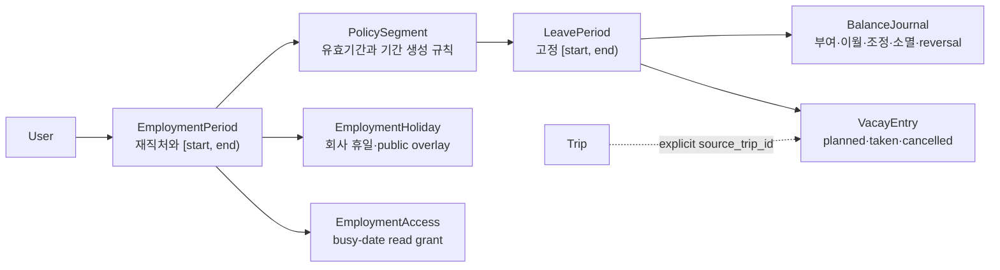

# Vacay Employment and Balance Design

> 작성일: 2026-07-28
> 상태: 제품 기본값 승인, 구현 전 upstream Discord 범위 승인 대기
> 기준: fork `main` `c5ff1d27`, upstream `dev` `351b5fb4`

## 결론

Vacay를 단순한 `연도별 부여일수 - 달력 항목 수` 계산기에서 개인용
재직기간·휴가기간·잔액 추적기로 확장한다. 회사 변경과 정책 변경은 과거 값을
재해석하지 않고 유효기간이 있는 새 레코드로 남기며, 사용자는 `현재 잔여만 알고
있음`과 `총 부여·기사용을 알고 있음` 두 방식으로 시작할 수 있어야 한다.

범용 재직·기간·잔액·권한 모델은 `upstream-contrib` 후보이고, 한국 법정 산정은
코어 조건문이 아니라 사용자 확인형 policy provider로 분리한다. 현재 plugin
계약만으로는 native Vacay UI, core DB transaction, 공유·MCP 권한을 함께 보장할 수
없으므로 장기 원장을 plugin-owned DB에 먼저 구현하지 않는다.

## 승인된 제품 기본값

| 결정                   | MVP 기본값                 | 이유                                                                             |
| ---------------------- | -------------------------- | -------------------------------------------------------------------------------- |
| 동시 재직              | 제외                       | 한 시점에 활성 재직처 하나, 과거 재직처는 여러 개를 허용해 첫 범위를 제한한다.   |
| 공유                   | 재직처별 `busy dates only` | 회사명, 정책, 잔액, 메모, 조정 사유를 공유하지 않는다.                           |
| 한국 법정 자동 산정    | R2                         | 회사 규정·출근율·퇴직 정산 등 입력 없이 법정 잔액으로 확정하면 오판 위험이 크다. |
| 수량 저장              | 정수 minute                | MVP UI는 종일/반일만 제공하되 시간 단위 확장을 막지 않는다.                      |
| 사용량 source of truth | `VacayEntry`               | 잔액 journal에 사용량을 중복 기록하지 않는다.                                    |
| 회사 변경              | 이전 잔액 자동 이전 없음   | 새 재직처에 opening balance를 별도로 설정한다.                                   |

## 제품 경계

### 목표

- 한국 사용자가 회사별 재직기간과 휴가 기준기간을 명시적으로 관리한다.
- 회사 기준일, 입사일 기준, 직접 지정 기간을 모두 표현한다.
- 기사용, 예정 사용, 현재 잔여와 조정 근거를 구분한다.
- 회사·정책 변경 뒤에도 과거 기간과 계산 결과가 바뀌지 않는다.
- 기존 반차, 대체·보상휴무, 공휴일 overlay, 여행 계획, 읽기 전용 공유와
  호환된다.

### 비목표

- 휴가 신청·상사 승인, 관리자 결재선
- 급여·미사용수당·퇴직 정산의 확정 계산
- 근태·출퇴근, HRIS, 조직도와 부서 관리
- 법적 적합성 인증 또는 노무·법률 자문
- 사업자번호, 계약서, 증빙 문서 수집

이 기능은 개인 자기관리 도구다. 회사 HR 시스템으로 확장하지 않는다.

## 현재 상태와 선행 결함

최신 `upstream/dev`에는 반차(`#1631`), 보기 전용 공유(`#1637`),
대체·보상휴무와 calendar/fiscal/anniversary 기간(`#1679`)이 들어와 있다. 그러나
다음 구조적 한계는 남아 있다.

| 심각도 | 현재 동작                                                        | 근거와 영향                                                                         |
| ------ | ---------------------------------------------------------------- | ----------------------------------------------------------------------------------- |
| HIGH   | 사용자당 휴가기간 설정 한 행                                     | `vacay_user_settings.user_id`가 PK라 설정 변경 시 과거·미래 기간이 함께 재해석된다. |
| HIGH   | GET stats가 다음 해 carry를 UPSERT                               | read-only REST/MCP 호출이 DB 상태를 바꾼다.                                         |
| HIGH   | 회사·공휴일 적용이 휴가 entry를 삭제                             | 외부 holiday 데이터나 공동 사용자의 조작으로 개인 기록이 사라질 수 있다.            |
| HIGH   | fusion 참여자가 타인의 entry와 allowance를 수정                  | 표시 그룹이 데이터 소유권과 관리자 권한으로 확대된다.                               |
| HIGH   | fusion 해제 시 최신 user-year 상태가 개인 plan으로 돌아오지 않음 | 재직 중 수정된 잔액이 과거 값으로 되돌아갈 수 있다.                                 |
| HIGH   | 여행 시작일 변경이 같은 기간의 모든 개인 Vacay entry를 이동      | entry에 trip 출처가 없어 무관한 휴가도 이동한다.                                    |
| MED    | 하루·사용자·plan당 한 행                                         | 오전 연차와 오후 보상휴무, 시간 단위, 동시 재직을 표현하지 못한다.                  |

기능 구현 전에 독립 PR로 다룰 correctness 범위는
[upstream correctness proposal](2026-07-28-vacay-upstream-correctness-proposal.md)에
분리한다.

## 도메인 모델



### `EmploymentPeriod`

- `user_id`
- 사용자가 정한 회사 표시 이름
- `country_code`
- `starts_on`, nullable `ends_on`; `[start, end)` 계약
- `standard_day_minutes`
- 색상, active/archived 상태

MVP는 같은 날짜에 둘 이상의 active employment를 금지한다. 과거 employment는
읽기·정정 가능하고 기록이 있으면 hard delete 대신 archive한다.

### `PolicySegment`

- `employment_id`
- `effective_from`, nullable `effective_to`
- `period_basis`: `calendar | anniversary | fixed | custom`
- 기준 월·일 또는 직접 지정 규칙
- `standard_day_minutes`

정책 변경은 기존 행 수정이 아니라 새 segment 생성이다. 이미 생성된
`LeavePeriod`의 날짜와 snapshot은 바꾸지 않는다.

### `LeavePeriod`

- `employment_id`, `policy_segment_id`
- `starts_on`, `ends_on`; 항상 `[start, end)`
- 사람이 읽을 label
- 생성 당시 `standard_day_minutes` snapshot
- `open | closed` 상태

`2026` 같은 숫자만 보여 주지 않고 `2026-09-16 – 2027-09-15`처럼 실제 범위를
표시한다.

### `BalanceJournal`

허용 원인은 다음으로 제한한다.

- `opening_balance`
- `grant`
- `carry_in`
- `manual_adjustment`
- `expiry`
- `reversal`

사용량은 journal에 다시 기록하지 않는다. 모든 command는 단일 DB transaction과
idempotency key를 사용하고, 확정된 행을 덮어쓰거나 삭제하지 않고 reversal로
정정한다. R1에서는 entitlement lot과 allocation을 만들지 않으므로 정확한
FIFO·소멸·이월 추적을 지원한다고 표현하지 않는다.

### `VacayEntry`

- `employment_id`, `leave_period_id`
- `date`, `quantity_minutes`
- `kind`: 기존 `vacation | comp`와 호환
- `status`: `planned | taken | cancelled`
- nullable `source_trip_id`
- 메모, 작성자와 변경 시각

MVP UI는 종일/반일만 선택할 수 있다. canonical 수량은 정수 minute이고
`standard_day_minutes` snapshot을 함께 사용한다.

### `EmploymentHoliday`

회사 휴일은 plan 전역이 아니라 employment에 속한다. 공휴일 provider 결과는
overlay/provenance로 취급하며 개인 entry를 자동 삭제하지 않는다. 충돌은 사용자에게
보여 주고 제거·유지·종류 변경을 명시적으로 선택하게 한다.

### `EmploymentAccess`

MVP grant는 employment별 `busy_dates` 읽기만 제공한다. payload에는 날짜와
busy 상태를 제외한 회사명, 재직기간, 정책, 잔액, journal, 메모가 없어야 한다.
회사 변경 시 이전 employment의 grant를 새 employment로 자동 승계하지 않는다.

## 계산 계약

```text
current_balance =
  opening_balance + grants + carry_in + adjustments - expiry - taken_entries

available_after_planned =
  current_balance - planned_entries
```

- `cancelled` entry는 둘 다 차감하지 않는다.
- `comp` entry는 연차 account를 차감하지 않는다.
- 회사·공휴일은 entry를 지우지 않는다.
- 양은 DB와 API에서 integer minute이며 UI만 `일`로 환산한다.
- 하나의 command가 journal과 entry를 동시에 바꿔야 하면 같은 transaction에서
  처리한다.

### 초기 잔액 입력

`총 부여·기사용을 알고 있음`:

- 기준일의 `opening_balance = reported_grant - reported_used`
- metadata에 `reported_grant`, `reported_used`, `as_of`를 보존
- 기사용을 나타내는 가짜 날짜 entry는 만들지 않음

`현재 잔여만 알고 있음`:

- 기준일의 `opening_balance = reported_remaining`
- 부여·기사용은 `unknown`
- 기준일 이전 legacy entry는 보이되 opening balance에서 다시 차감하지 않음

이후 실제 날짜 entry만 source of truth로 차감한다.

## 권한 계약

| 데이터/동작           | 본인          | fusion 사용자                          | busy-date viewer | 관리자 일반 API |
| --------------------- | ------------- | -------------------------------------- | ---------------- | --------------- |
| employment·입사일     | CRUD          | 불가                                   | 불가             | 자동 우회 불가  |
| policy·period         | CRUD          | 불가                                   | 불가             | 자동 우회 불가  |
| journal·잔액 조정     | CRUD/reversal | 불가                                   | 불가             | 자동 우회 불가  |
| 본인 entry            | CRUD          | 명시적 `edit_events` grant가 있을 때만 | 불가             | 자동 우회 불가  |
| busy dates            | 조회          | plan 표시 범위에서 조회                | 허용             | 자동 우회 불가  |
| 회사명·정책·잔액·메모 | 조회          | 본인 소유만                            | 불가             | 자동 우회 불가  |

REST, MCP, plugin RPC와 WebSocket이 같은 application service 권한 판정을 사용한다.
fusion은 기본적으로 캘린더 표시 그룹이며 데이터 소유권을 이동시키지 않는다.

## 주요 사용자 흐름

### 첫 설정

1. 회사 표시 이름과 입사일을 입력한다.
2. `회사 기준일`, `입사일 기준`, `직접 지정` 중 하나를 선택한다.
3. `현재 잔여만 입력` 또는 `총 부여·기사용 입력`을 선택한다.
4. 생성될 정확한 기간과 opening balance를 미리 본다.
5. 확인 command 한 번으로 employment, policy, period, opening을 생성한다.

### 회사 변경

1. 이전 employment 종료일과 새 employment 시작일을 함께 확인한다.
2. 기간 겹침을 저장 전에 차단한다.
3. 이전 기록과 잔액을 archive하되 변경하지 않는다.
4. 새 회사에 별도 정책과 opening balance를 입력한다.
5. 이전 잔액과 공유 grant는 자동 이전하지 않는다.

### 정책 변경

적용일과 새 정책을 미리 보고 새 `PolicySegment`를 생성한다. 과거 segment와 이미
생성된 period는 immutable이다.

### 휴가 등록과 정정

- 미래 날짜는 `planned`, 지난 날짜는 기본 `taken`으로 제안하되 사용자가 바꿀 수
  있다.
- 날짜를 다시 누르면 즉시 삭제하지 않고 편집 sheet를 연다.
- entry 삭제는 `cancelled`, journal 정정은 reversal을 사용한다.
- trip 날짜 변경은 `source_trip_id`가 정확히 일치하는 planned entry만 사용자 확인
  뒤 이동한다.

## UI/UX 구조

Vacay 안에 전역 메뉴를 늘리지 않고 기간 중심 캘린더를 유지한다.

- 상단 context: 재직처, 정확한 휴가기간, 회사 변경
- 요약: 현재 잔여, 예정 반영 가용량, 사용, 부여·이월·조정
- 본문: 캘린더와 잔액 변동 drawer/sheet
- 설정: 재직처·정책, 휴일 overlay, 공유

상태를 `재직처 없음`, `현재 재직처 없음`, `기간 없음`, `기록 없음`,
`provider partial error`, `blocking load error`, `overlap conflict`, `archived`로
구분한다. 날짜는 실제 button/gridcell로 구현하고 keyboard 이동, Enter/Space,
focus 복귀, 44px mobile target, 색상 외의 상태 표기를 제공한다.

390px에서는 연간 보기를 read-only로 두고 한 달 편집을 sheet로 제공한다.
Fold/태블릿은 상단 context bar와 1~2열 월 카드, 1440px은 summary rail과 3~4열
캘린더를 기본으로 한다.

## MVP와 R2

### MVP

- 단일 active employment, 과거 employment 여러 개
- effective-dated policy와 고정 leave period
- 회사 기준일·입사일·직접 지정
- opening/grant/carry/manual adjustment/expiry/reversal journal
- planned/taken/cancelled entry
- 종일·반일과 기존 comp 호환
- 회사 변경 wizard와 archive
- employment별 busy-date 공유
- legacy Vacay compatibility projection

### R2

- 동시 active employment
- 시간 단위 입력 UI
- 한국 policy suggestion provider와 versioned rule set
- entitlement lot/allocation과 정확한 expiry/carry/FIFO
- 대체·보상휴무 earned/used bank
- 소멸 예정 알림, CSV import/export, 사용자 정의 leave type

## 한국 정책 provider 경계

한국 규칙은 자동 확정 transaction을 만들지 않는다. 공식 자료와 정책 버전을
표시한 `proposal`을 만들고 사용자가 확인할 때만 grant/adjustment command로
전환한다. 회사 취업규칙, 상시근로자 수, 출근율, 단시간 근로, 퇴직 정산처럼
제품이 모르는 입력은 `unknown`으로 남긴다.

2026-07-28 기준 확인한 공식 자료:

- [근로기준법 현행본](https://www.law.go.kr/LSW/lsInfoP.do?chrClsCd=010202&efYd=20251023&joNo=002300&lsiSeq=265959&urlMode=lsInfoP)
- [회계연도 기준 운용과 퇴직 시 비교 정산 행정해석](https://1350.moel.go.kr/rtmview.do?id=1000120046&page=19616&type=BEST)
- [최초 1년 종료 후 15일 부여 법제처 해석](https://www.law.go.kr/LSW/expcInfoP.do?expcSeq=339035&mode=2)
- [반차는 회사 규정·노사 합의로 운영 가능하다는 고용노동부 안내](https://1350.moel.go.kr/rtmview.do?id=1000315635)
- [2027-06-10 시행 예정 시간 단위 분할 법률](https://law.go.kr/LSW/lsRvsDocListP.do?chrClsCd=010202&lsId=001872&lsRvsGubun=all)
- [반일·연 5일 시행령안 입법예고](https://moleg.go.kr/lawinfo/makingInfo.mo?currentPage=1&lawCd=0&lawSeq=87572&lawType=TYPE5&mid=a10104010000&pageCnt=10)

시행령안은 입법예고 상태이므로 확정 규칙으로 사용하지 않는다. 법률·행정해석은
법률 자문이 아니라 데이터 모델이 수용해야 할 변동성의 근거다.

## 호환·migration 전략

공식 구현은 최신 `upstream/dev`에서 additive migration과 compatibility adapter로
시작한다.

1. legacy row를 건드리지 않고 v2 테이블을 추가한다.
2. `vacay_user_settings`와 user-year/entry를 default employment 후보로 dry-run
   projection한다.
3. 동일 user/year에 충돌하는 plan 값은 자동 선택하지 않고 `review_required`로
   보고한다.
4. legacy entry는 기존 fraction/kind를 보존한다. opening 기준일 이전 entry는
   재차감하지 않는다.
5. plan company holiday는 각 employment로 provenance와 함께 복사하되 entry를
   삭제하지 않는다.
6. user별 feature flag로 v2 single-write를 활성화한다.
7. checksum·잔액 reconciliation 후 legacy API를 v2 projection으로 읽는다.
8. 원본 테이블은 최소 두 release 동안 삭제하지 않는다.

장기 dual-write는 금지한다. 첫 v2 write 뒤에는 old image가 새 원장을 이해하지
못하므로 code-only rollback으로 간주하지 않는다. 운영 배포가 필요해지는 시점에
owner-only SQLite backup, restore rehearsal, immutable image와 reverse projection
도구를 별도로 승인받는다.

## 모듈화와 기여 lane

| 범위                                  | lane                                 | 제거·확장 기준                                 |
| ------------------------------------- | ------------------------------------ | ---------------------------------------------- |
| employment/period/journal/access core | `upstream-contrib`                   | 공식 release에 포함되면 포크 adapter 없이 사용 |
| 한국 rule proposal provider           | plugin 또는 별도 generic provider PR | core policy-provider contract 확정 뒤 추가     |
| JSNetworkCorp 조기 pilot adapter      | 필요할 때만 `fork-core`              | 공식 release 통합과 동등성 검증 후 제거        |
| 도메인·Compose·운영 설정              | `instance-only`                      | 공식 PR 금지                                   |

현재 plugin SDK의 별도 SQLite와 제한된 Vacay API는 core DB와 원자적으로
transaction할 수 없고 native UI·공유·MCP를 일관되게 확장하지 못한다. 따라서
plugin-only 원장은 채택하지 않는다.

## 수용 기준

1. 회사 기준일과 입사일 기준 기간이 정확한 `[start, end)`로 표시된다.
2. 회사나 정책을 변경해도 과거 period, entry, journal과 잔액이 변하지 않는다.
3. 회사 변경 시 이전 잔액과 share가 새 회사로 자동 이전되지 않는다.
4. 현재 잔여 7.5일 입력은 기준일 opening으로 남고 가짜 날짜를 만들지 않는다.
5. 총 부여 15일·기사용 3.5일 입력은 opening 11.5일과 원본 metadata로 남는다.
6. 사용량은 entry에서만 계산되고 journal과 이중 차감되지 않는다.
7. taken과 planned를 분리해 현재 잔여와 예정 반영 가용량을 함께 표시한다.
8. 회사·공휴일 추가와 provider refresh가 개인 entry를 삭제하지 않는다.
9. fusion 사용자와 busy-date viewer는 타인의 employment·policy·잔액을 수정하거나
   볼 수 없다.
10. REST/MCP read 뒤 SQLite `total_changes()`와 관련 행이 변하지 않는다.
11. trip 날짜 변경은 출처가 없는 entry를 이동하지 않는다.
12. 390px, Fold/태블릿, 1440px에서 context와 주요 CTA가 겹치지 않는다.
13. provider 실패 시 수동 휴가 입력과 잔액 조회는 계속 동작한다.
14. 재시도된 command는 같은 idempotency key로 한 번만 반영된다.

## 구현 gate

공식 프로젝트 규칙상 코드 작성 전에 Discord `#github-pr` 승인이 필요하다. 먼저
독립 correctness PR 후보와 generic v2 방향을 제안하고, maintainer가 선택한 가장
작은 범위만 최신 `upstream/dev`의 별도 worktree에서 구현한다. 이 문서 작성만으로
공식 저장소 push, PR 생성 또는 포크 운영 배포를 승인한 것으로 보지 않는다.
