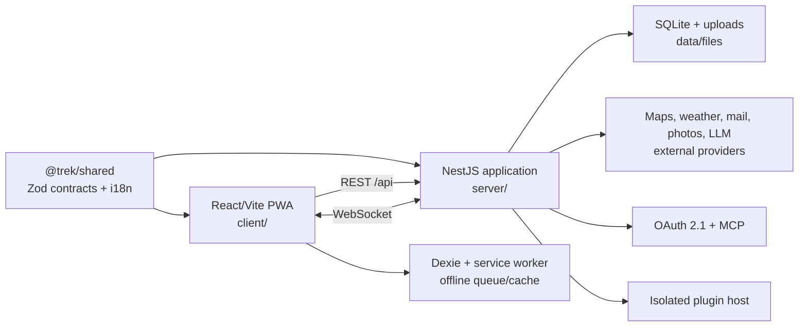

# TREK Project Source Map

> 마지막 확인: 2026-07-20, v3.4.x 통합 기준 `86d3e9a0`, TREK `3.4.1`
>
> 이 문서는 사람이 저장소를 탐색하기 위한 source map이다. Vite/TypeScript가 만드는
> JavaScript `.map` artifact나 production stack-trace 공개 설정을 의미하지 않는다.

## System shape

`server/src/bootstrap.ts`가 unified NestJS application을 조립한다. Express는 독립
애플리케이션이나 fallback router로 남아 있지 않고 Nest의 HTTP adapter로만 사용된다.
과거 코드를 위임하는 service나 `legacy`라는 주석은 API 호환성 근거이며 활성 strangler
경로를 뜻하지 않는다.

## Runtime entry points

| Surface          | Entry point                                                         | Responsibility                                                                         |
| ---------------- | ------------------------------------------------------------------- | -------------------------------------------------------------------------------------- |
| Browser/PWA      | [`client/src/main.tsx`](../client/src/main.tsx)                     | Router, global CSS, connectivity probe와 persistent storage 초기화                     |
| Client routes    | [`client/src/App.tsx`](../client/src/App.tsx)                       | 공개/인증/admin/addon route, app config와 global UI host                               |
| REST client      | [`client/src/api/client.ts`](../client/src/api/client.ts)           | `/api` Axios client, socket/idempotency header와 typed domain calls                    |
| Live sync        | [`client/src/api/websocket.ts`](../client/src/api/websocket.ts)     | WebSocket session ID와 reconnect; store의 remote event handler로 전달                  |
| Server process   | [`server/src/index.ts`](../server/src/index.ts)                     | data/upload directory, HTTP server, scheduler, WebSocket와 shutdown lifecycle          |
| HTTP composition | [`server/src/bootstrap.ts`](../server/src/bootstrap.ts)             | middleware → platform routes → static/docs → Nest controllers 순서 고정                |
| Server modules   | [`server/src/nest/app.module.ts`](../server/src/nest/app.module.ts) | 전체 domain module, exception/SPA filter와 idempotency interceptor 등록                |
| Database         | [`server/src/db/database.ts`](../server/src/db/database.ts)         | better-sqlite3 singleton, schema/migration/seed 초기화와 restore 재연결                |
| Contracts        | [`shared/src/index.ts`](../shared/src/index.ts)                     | client/server가 공유하는 Zod request/response schema와 순수 helper export              |
| Plugin SDK       | [`plugin-sdk/src/index.ts`](../plugin-sdk/src/index.ts)             | plugin author-facing types와 capability contract; root npm workspace 밖에서 별도 build |

## Repository map

| Path                                          | Owns                                                    | Start here when                                     |
| --------------------------------------------- | ------------------------------------------------------- | --------------------------------------------------- |
| `client/src/pages/`                           | route-level wiring containers와 co-located data hooks   | 페이지 workflow 또는 route를 바꿀 때                |
| `client/src/components/`                      | reusable UI와 planner/admin/settings feature UI         | 화면 조각, responsive layout, 접근성을 바꿀 때      |
| `client/src/store/`                           | Zustand state와 remote-event reconciliation             | 낙관적 상태, 실시간 갱신, 권한 기반 state를 바꿀 때 |
| `client/src/repo/`, `client/src/api/`         | offline-aware repository와 HTTP/WebSocket transport     | 서버 contract 또는 mutation retry를 바꿀 때         |
| `client/src/sync/`, `client/src/db/`          | service worker와 IndexedDB/offline mutation lifecycle   | offline/PWA 동작을 바꿀 때                          |
| `server/src/nest/`                            | controller, guard, module과 thin domain service         | HTTP route/auth/status/error contract를 바꿀 때     |
| `server/src/services/`                        | SQL, provider integration과 core business side effect   | business rule 또는 외부 provider 동작을 바꿀 때     |
| `server/src/db/`                              | schema, official/fork migration, seed와 DB singleton    | persistent data shape를 바꿀 때                     |
| `server/src/mcp/`                             | OAuth scope 기반 MCP tools/resources/prompts            | AI automation surface를 바꿀 때                     |
| `server/src/websocket.ts`                     | authenticated connection과 scoped broadcast transport   | collaboration fan-out/privacy를 바꿀 때             |
| `shared/src/`                                 | cross-workspace Zod contract와 23 locale registry       | API shape, enum, 번역 key를 바꿀 때                 |
| `plugin-sdk/`                                 | isolated plugin manifest, permissions, egress와 CLI     | core 변경 없이 확장 가능한 기능을 만들 때           |
| `android/twa/`                                | JSNetworkCorp Android TWA source와 association metadata | APK identity, target SDK, signing 검증을 바꿀 때    |
| `Dockerfile`, `docker-compose.yml`, `charts/` | official container와 deployment templates               | 배포 artifact 또는 public config를 바꿀 때          |
| `docs/`, `wiki/`                              | maintainer evidence와 product/user help                 | 운영 계약 또는 사용자 문서를 바꿀 때                |

Host 전용 `docker-compose.override.yml`, credential, signing material과 운영 DB는 Git
밖에 둔다. `node_modules/`, workspace별 `dist/`, test report와 build output도 source가
아니다.

## Request and data flow

1. `client/src/App.tsx`가 route 보호와 addon/admin gate를 적용한다.
2. page hook 또는 store action이 `client/src/repo/`/`client/src/api/client.ts`를 호출한다.
3. mutating request에는 `X-Idempotency-Key`와 가능한 경우 `X-Socket-Id`가 붙는다.
4. `server/src/bootstrap.ts`의 global middleware와 Nest guard가 origin, auth, MFA와
   permission을 검사한다.
5. controller는 `server/src/nest/<domain>/` service를 통해 기존 core service와 SQLite
   transaction/provider side effect를 호출한다.
6. 성공한 협업 mutation은 요청 socket을 제외하거나 viewer scope를 적용해 WebSocket으로
   fan-out되고, client store가 remote event를 반영한다.
7. offline mutation은 IndexedDB queue에 보관됐다가 동일 idempotency key로 재전송된다.

## Change path by task

| Change                  | Required path                                                                     | Minimum evidence                                                                                       |
| ----------------------- | --------------------------------------------------------------------------------- | ------------------------------------------------------------------------------------------------------ |
| API/domain contract     | `shared/src/<domain>` → `server/src/nest/<domain>` → client API/repo/store        | shared schema test, server unit/e2e, client consumer test, typecheck                                   |
| Client page workflow    | `client/src/pages/<Page>.tsx` + `pages/<page>/use<Page>.ts`                       | page/hook Vitest, `npm run lint:pages`, target viewport if layout changes                              |
| Real-time collaboration | server service/controller → `server/src/websocket.ts` → client remote-event slice | sender exclusion, allowed viewer와 revoked viewer negative tests                                       |
| Official DB change      | `server/src/db/migrations.ts`                                                     | upstream migration tests, fresh/upgrade/replay/partial-state evidence                                  |
| Fork DB change          | `server/src/db/forkMigrations.ts` + `migrationRunner.ts`                          | stable `jsnetworkcorp.*` ID, official-first order, unknown state fail-closed, backup/restore rehearsal |
| Plugin capability       | `plugin-sdk/` + `server/src/nest/plugins/`                                        | manifest/permission/egress tests와 host-bound auth/privacy tests                                       |
| Android TWA             | `android/twa/` + public release route                                             | project verifier, signed artifact metadata와 Digital Asset Links 확인                                  |

## Fork-maintained hotspots

| Surface                      | Primary source                                                                                                                  | Boundary                                                                 |
| ---------------------------- | ------------------------------------------------------------------------------------------------------------------------------- | ------------------------------------------------------------------------ |
| Map label locale             | `client/src/components/Map/glProviders.ts`, `MapViewGL.tsx`, `Settings/MapSettingsTab.tsx`, `client/src/store/settingsStore.ts` | provider expression을 보존하고 locale name만 fallback                    |
| Fold/Tablet map controls     | `client/src/components/Map/AdaptiveMapControls.tsx`, `client/src/utils/mapViewport.ts`                                          | 양쪽 panel corridor, 44px target와 keyboard/focus contract               |
| Google enrichment/cost guard | `server/src/services/placeEnrichment.ts`, `googleApiUsageService.ts`, maps/admin services, client admin/enrichment UI           | 외부 호출 전 usage reservation, admin-only visibility, instance hard cap |
| Packing privacy/templates    | `server/src/services/packingService.ts`, Nest packing controller/service, shared packing schema, client packing UI              | Common/Personal/Shared viewer와 writer 권한, instance template scope     |
| Migration collision bridge   | `server/src/db/migrationRunner.ts`, `forkMigrations.ts`                                                                         | official numeric migration과 fork string ID 분리                         |
| Android/package identity     | `android/twa/`, `server/src/nest/platform/android-release.routes.ts`                                                            | signing material은 Git/runtime 밖, 고정 파일만 공개                      |

세부 lane, retirement 조건과 다음 upstream release 절차는
[`docs/upstream/README.md`](upstream/README.md)를 따른다.

## Verification map

| Scope                | Command                                                                                              |
| -------------------- | ---------------------------------------------------------------------------------------------------- |
| Root build           | `npm run build`                                                                                      |
| Root tests           | `npm test`                                                                                           |
| Coverage             | `npm run test:cov`                                                                                   |
| Shared contract/i18n | `npm run typecheck --workspace=shared`; `npm run i18n:parity:strict --workspace=shared`              |
| Server               | `npm run typecheck --workspace=server`; `npm run test:coverage --workspace=server`                   |
| Client               | `npm run typecheck --workspace=client`; `npm run lint:pages --workspace=client`; `npm run test --workspace=client`; targeted Playwright |
| Plugin SDK           | `cd plugin-sdk && npm run typecheck && npm test && npm run build`                                    |
| Android TWA          | commands documented in `android/twa/README.md`                                                       |

테스트 fixture는 `server/tests/fixtures/`와 client E2E setup을 사용한다. 운영 DB,
credential 또는 실제 사용자 session을 일반 test input으로 사용하지 않는다.
클라이언트 Vitest의 공용 MSW server는 미처리 요청을 수집하고 `afterEach`에서 테스트를
실패시키므로 정상 mount에서 발생하는 background fetch는 가장 가까운 domain handler에
실제 API envelope와 같은 기본 응답을 둔다. React `act()` 경고는 owning test에서
동기화하고, 테스트 router에는 운영과 같은 v6 future flag 값을 명시한다. 실제 문서 이동은
작은 browser adapter를 mock/assert하며 전역 `console` 필터나 catch-all request bypass로
경고를 숨기지 않는다.

## Keeping this map current

다음 변경에는 이 문서를 함께 갱신한다.

- runtime/bootstrap entry point나 AppModule composition 변경
- top-level directory 또는 workspace ownership 변경
- auth, migration, WebSocket/privacy, provider cost 경계 변경
- fork-maintained hotspot의 이동·upstream 수용·제거
- 표준 build/test command 변경

새 파일을 모두 열거하지 않는다. 탐색 시작점, ownership과 위험 경계만 유지하고 세부 구현은
가까운 README, schema와 테스트를 source of truth로 삼는다.
